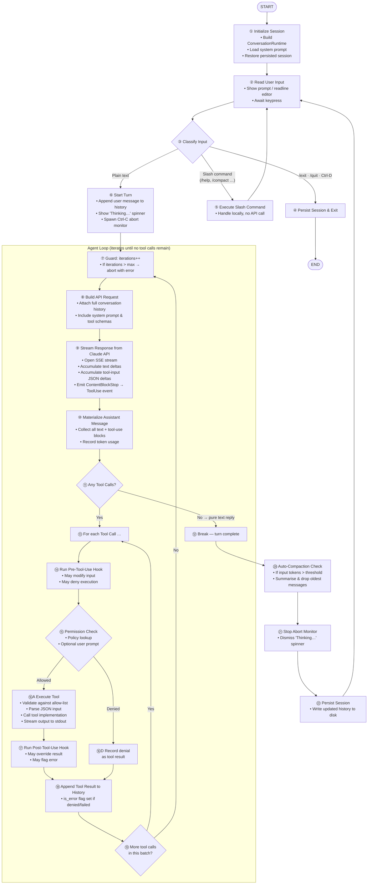

# Conversation Loop — Diagram & Pseudo Code

> Source references:
> - REPL loop: `rust/crates/rusty-claude-cli/src/main.rs` → `run_repl()` (line 1408)
> - Agent loop: `rust/crates/runtime/src/conversation.rs` → `ConversationRuntime::run_turn()` (line 286)

---

## Mermaid Diagram



---

## Pseudo Code

Each numbered step corresponds directly to a node in the diagram above and
is intended as an independent animation frame.

```
── INITIALIZATION ────────────────────────────────────────────────────────────

STEP ①  Initialize Session
    system_prompt  ← build_system_prompt()
    session        ← load_or_create_session()
    runtime        ← ConversationRuntime {
                         session, api_client, tool_executor,
                         permission_policy, system_prompt,
                         max_iterations = MAX_USIZE
                     }

─────────────────────────────────────────────────────────────────────────────
── REPL LOOP  (repeats forever until user exits) ────────────────────────────

LOOP:

STEP ②  Read User Input
    input ← editor.read_line()          // blocks; returns Submit | Cancel | Exit

STEP ③  Classify Input
    IF input == Exit (Ctrl-D):
        GOTO ④
    IF input starts with '/':
        GOTO ⑤
    GOTO ⑥

STEP ④  Persist Session & Exit
    session.persist()
    BREAK LOOP

STEP ⑤  Execute Slash Command
    handle_slash_command(input)         // /help, /compact, /exit, …
    CONTINUE LOOP  (→ STEP ②)

─────────────────────────────────────────────────────────────────────────────
── TURN SETUP ────────────────────────────────────────────────────────────────

STEP ⑥  Start Turn
    session.push_message(UserMessage(input))
    spinner.start("Thinking…")
    abort_monitor.spawn()               // listens for Ctrl-C
    iterations ← 0

─────────────────────────────────────────────────────────────────────────────
── AGENT LOOP  (iterates until Claude stops requesting tools) ────────────────

LOOP:

STEP ⑦  Guard — Iteration Check
    iterations ← iterations + 1
    IF iterations > max_iterations:
        spinner.stop(error)
        RETURN Err("exceeded max iterations")

STEP ⑧  Build API Request
    request ← ApiRequest {
        system   : system_prompt,
        messages : session.history(),   // full conversation so far
        tools    : tool_schemas(),
        stream   : true
    }

STEP ⑨  Stream Response from Claude API
    stream ← api_client.open_sse_stream(request)
    events ← []
    FOR EACH sse_event IN stream:
        MATCH sse_event:
            TextDelta(text)      → events.push(TextDelta(text))
                                   stdout.write(text)          // live output
            InputJsonDelta(json) → accumulate tool-input JSON
            ContentBlockStop     → IF pending tool use:
                                       events.push(ToolUse(id, name, input))
            MessageDelta         → events.push(Usage(usage))
            MessageStop          → events.push(Stop); BREAK

STEP ⑩  Materialize Assistant Message
    assistant_msg ← build_assistant_message(events)
                    // groups Text + ToolUse content blocks
    session.push_message(assistant_msg)
    usage_tracker.record(assistant_msg.usage)

STEP ⑪  Any Tool Calls?
    pending_tools ← assistant_msg.tool_use_blocks()
    IF pending_tools.is_empty():
        GOTO ⑫                         // normal completion

    // else fall through to tool-execution loop

─────────────────────────────────────────────────────────────────────────────
── TOOL EXECUTION  (one pass per tool call in the current batch) ─────────────

    FOR EACH tool_call IN pending_tools:

STEP ⑭      Run Pre-Tool-Use Hook
        hook_result ← hooks.run_pre_tool_use(tool_call.name, tool_call.input)
        effective_input ← hook_result.updated_input OR tool_call.input

STEP ⑮      Permission Check
        IF hook_result.denied:
            outcome ← Deny(hook_result.reason)
        ELSE:
            outcome ← permission_policy.authorize(tool_call.name, effective_input)
                       // may call permission_prompter → user y/n prompt

        IF outcome == Deny:
            GOTO ⑯D
        ELSE:
            GOTO ⑯A

STEP ⑯A     Execute Tool  [Allowed path]
        record_tool_started(tool_call)
        result ← tool_executor.execute(tool_call.name, effective_input)
                  // validates allow-list, parses JSON, runs implementation
                  // streams markdown output to stdout in real time
        is_error ← result.is_err()

STEP ⑰     Run Post-Tool-Use Hook
        IF is_error:
            post_result ← hooks.run_post_tool_use_failure(tool_call, result)
        ELSE:
            post_result ← hooks.run_post_tool_use(tool_call, result)
        IF post_result.denied: is_error ← true
        output ← merge(result.output, post_result.feedback)
        GOTO ⑱

STEP ⑯D     Record Denial  [Denied path]
        output   ← outcome.reason
        is_error ← true

STEP ⑱     Append Tool Result to History
        result_msg ← ToolResultMessage {
            tool_use_id : tool_call.id,
            tool_name   : tool_call.name,
            output      : output,
            is_error    : is_error
        }
        session.push_message(result_msg)

STEP ⑲     More Tool Calls?
    END FOR (if more tools → next iteration of FOR loop → STEP ⑭)

    CONTINUE AGENT LOOP  (→ STEP ⑦)   // send results back to Claude

─────────────────────────────────────────────────────────────────────────────
── POST-TURN ─────────────────────────────────────────────────────────────────

STEP ⑫  Break — Turn Complete
    (exit AGENT LOOP)

STEP ⑳  Auto-Compaction Check
    IF session.input_tokens() > auto_compaction_threshold:
        compacted ← compact_session(session)   // summarise + drop old messages
        session ← compacted

STEP ㉑  Stop Abort Monitor & Dismiss Spinner
    abort_monitor.stop()
    spinner.stop("Done")

STEP ㉒  Persist Session
    session.persist()

    CONTINUE REPL LOOP  (→ STEP ②)
```

---

## Animation Frame Map

| Frame | Step(s) | Scene description |
|------:|---------|-------------------|
| 1  | ①     | Session box appears; system prompt + history load in |
| 2  | ②     | Cursor blinks in terminal; user types a message |
| 3  | ③     | Router diamond lights up; arrow selects "Plain text" path |
| 4  | ⑥     | User message appended to history tape; spinner starts |
| 5  | ⑦     | Iteration counter increments; guard rail shown |
| 6  | ⑧     | Request envelope assembles (history + system + tools) |
| 7  | ⑨     | SSE stream flows in; text tokens land token-by-token |
| 8  | ⑩     | Tokens coalesce into AssistantMessage block |
| 9  | ⑪     | Tool-call badges appear on message; router branches |
| 10 | ⑭     | Pre-hook fires; input may mutate |
| 11 | ⑮     | Permission shield checks; green = allow, red = deny |
| 12 | ⑯A    | Tool box executes; stdout stream flows out |
| 13 | ⑰     | Post-hook fires; result may be annotated |
| 14 | ⑱     | ToolResult block appended to history tape |
| 15 | ⑲     | Loop arrow back to ⑦ with new iteration |
| 16 | ⑪→⑫  | No tool calls; loop arrow breaks out |
| 17 | ⑳     | Compaction: old messages compress; token counter drops |
| 18 | ㉑㉒  | Spinner stops; session saved; prompt returns |
